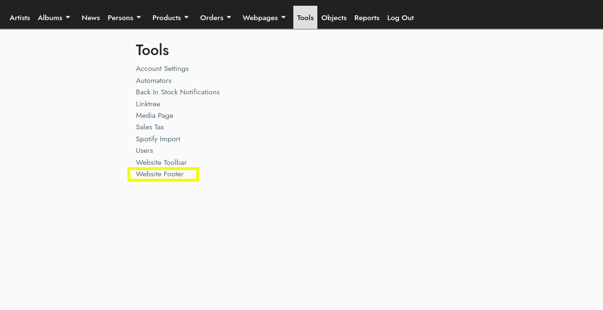

## Getting Started 
#### Located Under Tools on the Menu Bar:  

``/cms/footer``

## Footer Modules

Each section in the footer is a footer module.  There are three types of footer modules:
- Links
    - Identical to the Toolbar Link Module
- Email Signup (Mailchimp)
    - Uses the mailchimp information from your account page (/cms/account)
- Socials
    - Uses the socials information from your account page (/cms/account)
