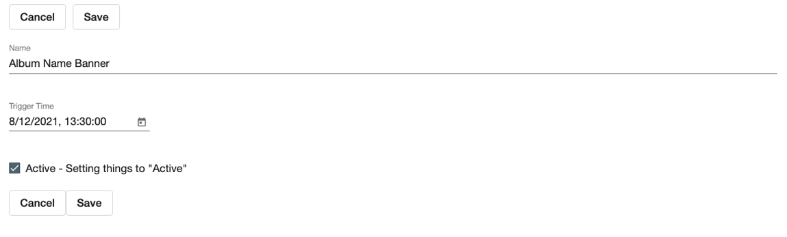
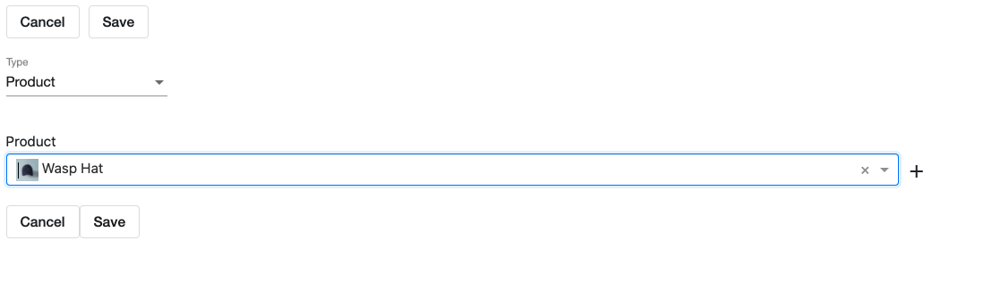

# How to Use the Automation Tool:
> Quickly schedule news, tracks, albums, banners, products, bundles and product lists to be ACTIVE or INACTIVE at a set time! 

### Located Under Tools on the Menu Bar:  
Select "Automators"  
Or go straight here:  /cms/automators 
 
Select "+ Add"  

### Creating a New Automation:  

<kbd></kbd>
 
 

#### Name:
Internal -- whatever you want!  

#### Trigger Time: 
This time will be based on time zone the website is located. 
Use 5 minute increments when setting time, otherwise will just round up to nearest 5 minute increment.  

#### Active - Setting things to "Active"  
Must already be inactive - will not turn active item inactive.  
Add for each item you would like to include in the automation.  
 
__Example:__ 
- Pre-order announcement. 

#### Inactive - Setting things to "Inactive"  
__Example:__ 
- Making products inactive when a sale ends.
- Making products inactive in future when distribution rights change.

### Adding Items: 

<kbd></kbd>

Select the type from the drop down.  
Select the item you'd like to schedule & hit save!  
