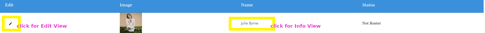

<!--# Dispatch Dept Documentation -->

## Welcome to the Dispatch Dept. Help Center! {docsify-ignore}

 :sparkles: :computer: We've compiled some helpful tips here for utilizing all the features of the Dispatch Dept. platform using the CMS.

See below for a brief overview of how to navigate the CMS.

## General CMS Overview  
 - **[Artist](artist_page.md)** > **[Album](album.md)** > **[Product](product.md)** > **[Instances](instances.md)**: 

## Editing - Edit View &amp; Info View {docsify-ignore}

Once you've added a new Artist, Album, Product or Instance there are two places to edit content &amp; features &mdash; the **Edit View** and the **Info View**. 

### Edit View
Controls basic elements such as Name, Sort Name, and URL.  
The **edit view** is located by clicking the pencil icon or the "edit" button.

### Info View
Controls more details and optional features, such as an Artist's photo, featured products, social media links, contacts and other data that is only accessible from this screen.  
The **info view** is displayed after clicking on the Artist name link once you have created an Artist. In this example below we created an Artists, Julie Byrne, and then clicked the link which was located under the name column.

<!-- 

#### Complete website, fully hosted
Fully integrated website and e-commerce platform.

Manage your entire website: store, artist pages, discography, news posts, media pages, and beyond.  Display products and integrate shopping seamlessly throughout your site—not just in the store.

We manage hosting of your entire site including file storage and databases using AWS’s secure and scalable systems.

#### Customized and unique selling tools

Advanced product bundling

Pre-order products (physical and digital)

Sell digital downloads (multiple formats including lossless)

[**Sales**](sale.md)

Full back-end customer and order management

####  So many additional features

Coupons, discount codes, and gift cards 
Generate unlimited download codes

Real-time reporting and sales dashboards

Soundscan/Music Connect reporting

Spotify pre-saves

[**Timed releases**](automation.md)-->

