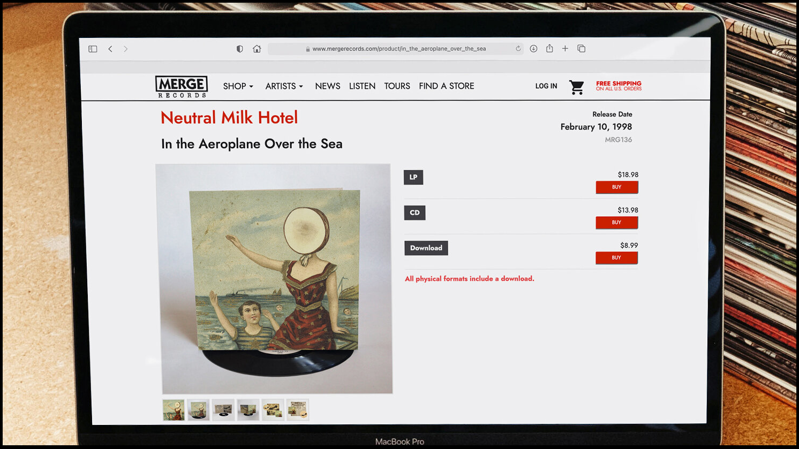

<!--# Dispatch Dept Documentation -->

### Welcome to the Dispatch Dept. Help Center!

We've compiled some helpful tips here for utilizing all the features of the Dispatch Dept. platform in the CMS, including an outline of the site organization below. 

> The CMS is organized by:  
> **[Artist](artist_page.md)** > **[Album](album.md)** > **[Product](product.md)** > **[Instances](instanced.md)**: 

<!-- 

#### Complete website, fully hosted
Fully integrated website and e-commerce platform.

Manage your entire website: store, artist pages, discography, news posts, media pages, and beyond.  Display products and integrate shopping seamlessly throughout your site—not just in the store.

We manage hosting of your entire site including file storage and databases using AWS’s secure and scalable systems.

#### Customized and unique selling tools

Advanced product bundling

Pre-order products (physical and digital)

Sell digital downloads (multiple formats including lossless)

[**Sales**](sale.md)

Full back-end customer and order management

####  So many additional features

Coupons, discount codes, and gift cards 
Generate unlimited download codes

Real-time reporting and sales dashboards

Soundscan/Music Connect reporting

Spotify pre-saves

[**Timed releases**](automation.md)-->

