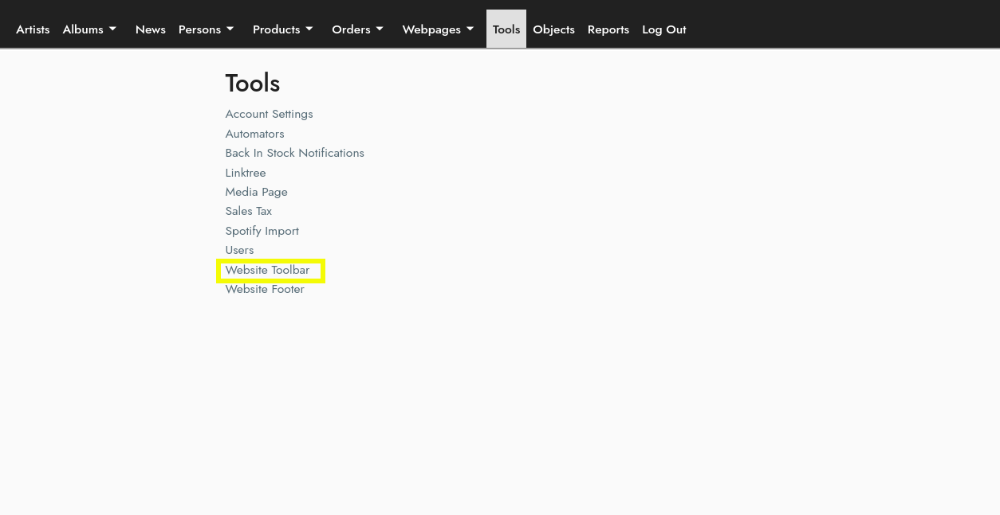

## Getting Started 
#### Located Under Tools on the Menu Bar:  

/cms/toolbar

## Toolbar Modules
Each link in the toolbar is a module.  There are simple modules and dropdown modules.

## Simple Modules
Simple modules link to specific features:
Artist
Includes a dropdown with all current-roster artists
News
Tour
Discography

## Dropdown Modules
The Store and Link modules allow you to create custom dropdowns.

## Link Module
To create a custom dropdown, select the link module.  Enter a url the user should go to when clicking this link.  You may use internal links, such as /about or /about/privacy_policy.  You can use external links such as https://google.com. Remember to include the https protocol.

To add links to the dropdown, click the link under the “header” or “module” columns.  You may link a webpage, a product list, or a custom link (internal or external).  The display order determines where each link lives in the dropdown.

## Store Module
The Store dropdown follows the same rules as the Link Module, however you can add multiple columns.  An artist dropdown and store search are included in the dropdown.  The display order determines where the link lives within the given column.
