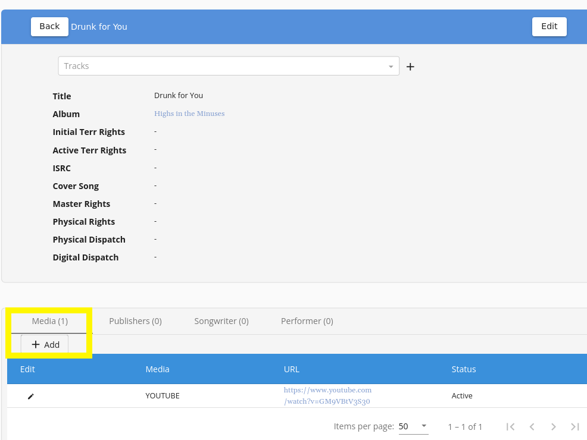
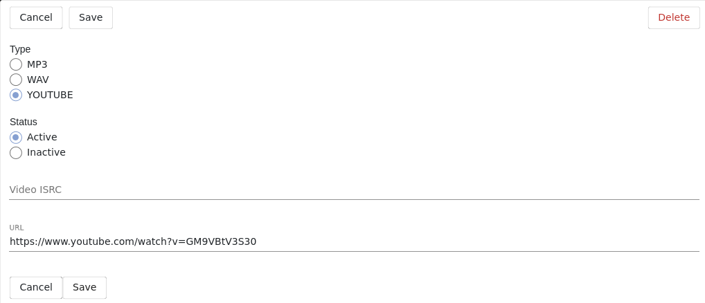

# How to Add YouTube Videos 
> Add YouTube videos to be displayed on the Artist Page as well as the Media section of your website. 

## Table of Contents
1. [Getting Started](#getting-started)
2. [Add Media](#add-media)

## Getting Started
Add Media onto the individual Track. 

Tracks Are Located Under the Albums Dropdown Menu  
Or go straight here:  ``/cms/tracks`` 
Select: **+ Add** to create a new track, or search for an existing track  

*There are several different ways to navigate to edit a track is by selecting the Album, and clicking on the individual Tracks listed on the info page.*

## Add Media
Click on the Track name to access the info view features:

Select **+ Add** under the Media section. Here you may select MP3, WAV or YOUTUBE. 

Please note the order YouTube videos are listed on the /media section is based on the order these were added into the CMS. 

The most recently added will be displayed first on the Media Page:

