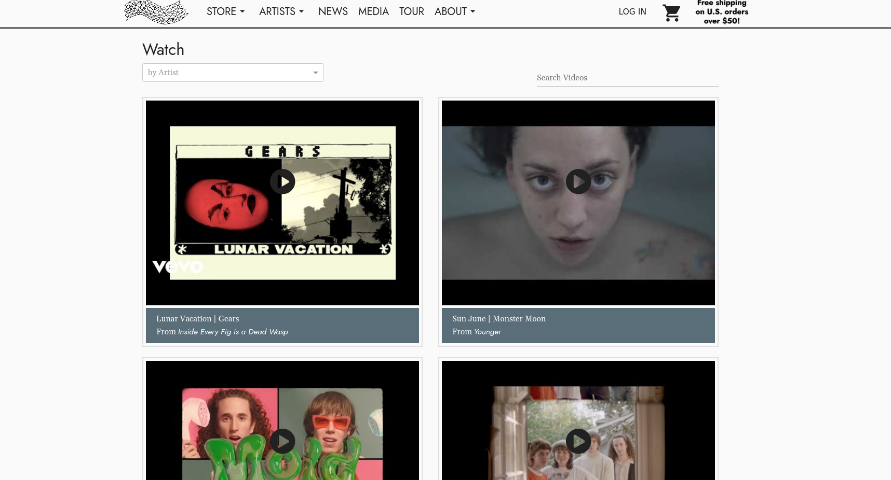

# How to Add YouTube Videos 
> Add Youtube videos to be displayed on the Artist Page as well as the Media section of your website. 

## Getting Started
#### Located Under the Albums Dropdown Menu &mdash; select "Tracks":  
Or go straight here:  ``/cms/tracks`` 
Select: **+ Add** or search for an existing track  

**The track must exist in the CMS in order to add the Youtube video link.**

Search by track Title to add Media. Another way to navigate to edit a track is by selecting the Album, and clicking on the individual Tracks listed on the details / info page. 

Select **+ Add** under the Media section. Here you may select MP3, WAV or YOUTUBE. 

Please note the order YouTube videos are listed on the /media section is based on the order these were added into the CMS. 

The most recently added will be displayed first. 

