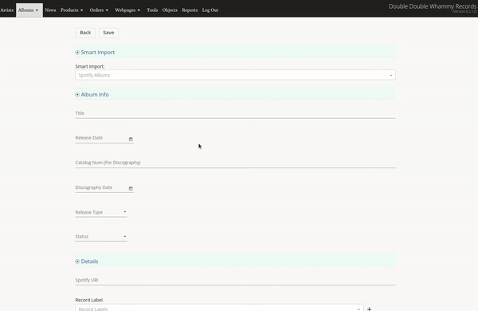
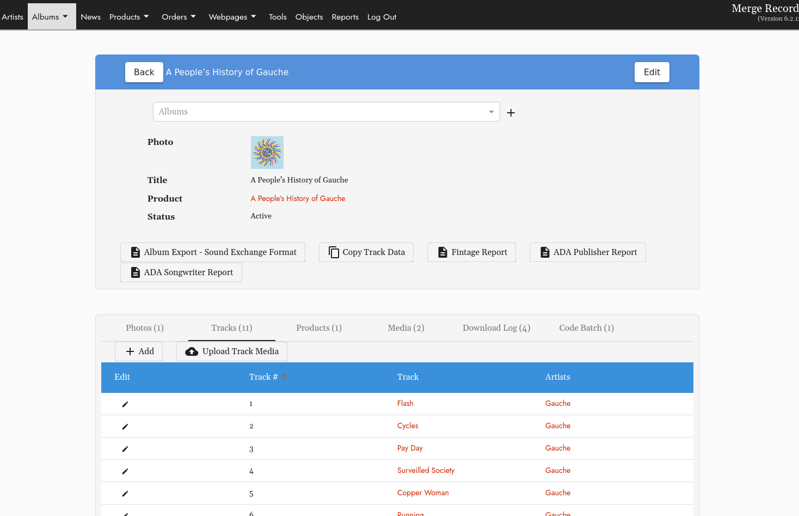
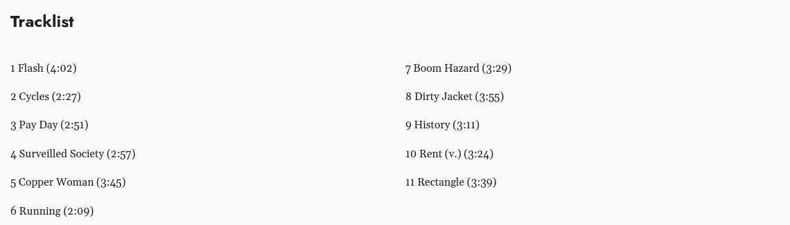

# How to Create an Album Page:
> Add Track Metadata, Products, Digital Media to an Album. 

## Table of Contents
1. [Getting Started](#getting-started) 
    - [Create Manually](#create-manually) 
    - [Import from Spotify](#import-from-spotify)
2. [Catalog Number](#catalog-number) 
3. [Discography Date & Release Date](#discography-date-amp-release-date)
4. [Track Information](#track-information)

## Getting Started
#### Located Under Artists:  
Or go straight here:  ``/cms/albums``  
Select: **+ Add**  

**Prior to creating an Album, the [Artist](artist_page.md) must be created.** 

If you are adding an Album for an Artist that has not yet been created, just select the **+** next to the Artists drop down which will direct you back to the add Artist page view to add a new artist. 

- ### Create Manually 
For an unreleased album or an album not in Spotify, you can manually enter the album information: 

**Remember to fill in the URL alias at the bottom.** You'll likely want to keep these consistent throughout your site, replace spaces with underscores, for example: "album_name"

- ### Import from Spotify
You can use the "Smart Import" tool in the edit view to quickly generate information using Spotify for any albums that are on Spotify. 

This will generate the album title, release date, release type, track metadata, discograpy date, Spotify URI and URL Alias. 

## Catalog Number
This is the root catalog number and will be displayed on the discography page. You will have an opportunity to add format specific catalog numbers on the Product Instances level. 

## Discography Date & Release Date
These dates may be different if you are reissuing a release. The Discography section will only display the Discography Date. The Product page will display the Release Date.  

## Track Information
The tracks associated with an album will be automatically generated using the Spotify Import tool when you create an album, or you can add them manually under the info view of the album: 

The Track List section of the product page will be generated based on this track data:
