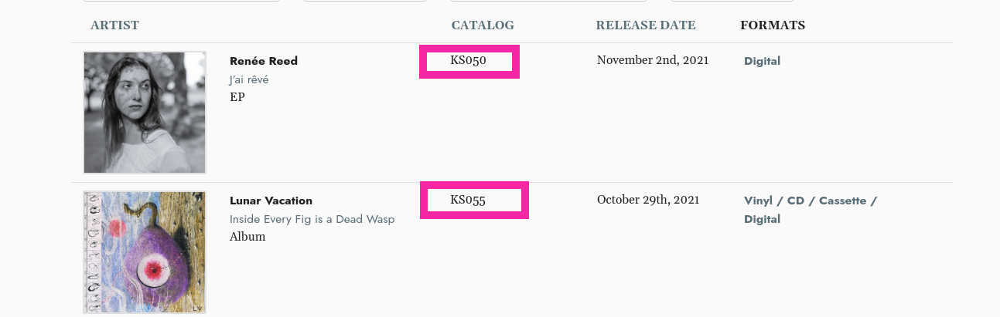

# How to Create Album Pages:
> Add track metadata, products, digital media to the Album. 

## Getting Started
#### Located Under Artists:  
Or go straight here:  ``/cms/albums``  
Select: **+ Add**  

**Prior to creating an Album, the [Artist](artist_page.md) must be created.** 

If you are adding an Album for an Artist that has not yet been created, just select the **+** next to the Artists drop down which will direct you back to the add Artist page view to add a new artist. 

## Smart Import 
You can use the Smart Import tool to quickly generate information using Spotify for existing albums. This will generate the album title, release date, release type, discograpy date, spotify URI and URL alias. 

If the album is unreleased or not available on Spotify &mdash; you can manually enter this information in. **Remember to fill in the URL alias at the bottom.** You'll likely want to keep these consistent throughout your site, replace spaces with underscores, for example: "album_name"

## Catalog Num
This is the root catalog number and will be displayed on the discography page. You will have an opportunity to add catalog numbers for different formats on the Product Instances level. 

## Discography Date & Release Date
These dates may be different if you are reissuing a release. The Discography section will only display the Discography Date. The Product page will display the Release Date.  
