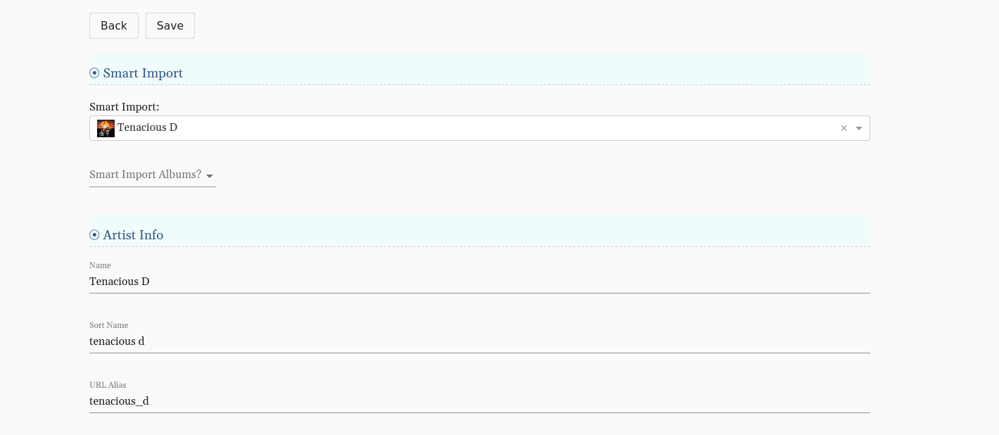

# How to Create Artist Pages:
> Edit artist photos, tour dates, roster status, social media links, featured products, email list and more!

## Getting Started
#### Located on the Toolbar Under "Artists":  
Or go straight here:  ``/cms/artists`` 
Select: **+ Add**  

**Creating an Artist page is the first step for adding any new product or album.** 

Once you have created an Artist (or Album, Product, Instance) there are two places to edit &mdash; the **edit view** and the **info** or **details view**: 

The edit view is located by clicking the pencil icon or the "edit" button  
``/cms/albums``

The details or info view is displayed after clicking on the link once you have created an Artist. In this example above we created an Artists, Julie Byrne, and then clicked the link which was located under the name column.

Here we can edit featured products, social media links, contacts and other data that is only accessible from this screen: 

``/cms/albums/info``

## Smart Import 
Once you've clicked add to create a new Artist, you will be taken to a blank edit screen. The **Smart Import** tool will quickly generate name, sort name, URL alias & Spotify Artist URI for existing artists. 

If the Artist is not on Spotify &mdash; you can manually enter this information in. 

**Remember to fill in the URL alias at the bottom.** To keep these consistent throughout your site, replace spaces with underscores so they match the Smart Import generated URLs, for example: ``/artist_name``

## Roster Status
Choose between **Active Roster**, **Full Roster**, **Inactive** or **Not On Roster**. 

Only Artists that are Active Roster will display on the Artists drop down on the Menu bar. This list of artists is also located at ``/artist``. 

Full Roster artists are displayed at the bottom of the Artist section. 

**Example:** If you'd like to sell products from Artists that are not on your label you would assign them "Not On Roster" so they are not displayed on these lists. 

## Bio
Add information about the Artist here to be displayed on the Artist page. 

## Email List

A “Join Email List” button will display if this artist has a Mailchimp URL and "Has Email List" is checked. 

## Songkick Artist ID 
The Tour section on each Artist page as well as the main Tour section of the website, pulls in tour dates based on the Songkick Artist ID. 

Add Songkick Artist ID under **Extra Information**. You can find the artist Songkick Artist ID in the URL of their Songkick page

**Example:** ``https://www.songkick.com/artists/8490418-katy-kirby``.  
The Songkick Artist ID is: **8490418**

For additional help troubleshooting any problems with tour dates displaying &mdash; please see the [Tours](tours.md) section.

## Photo
The artist photo with the lowest display order will be shown on the Artist page. Only one photo can currently be displayed at a time. 

## Links
Social media links will display underneath the Artist photo. You can edit these pages in the Links tab of the Artist detail / info page: 

## Releases
Releases may be added to the artist page under the "Artist Page Albums" tab. If there is a product associated with the album this image will be a link to that product.

## Featured Products
These products will be displayed to the right of the Artist photo. We recommend having two products here, because adding too many can look a little chaotic, but you can add more!

