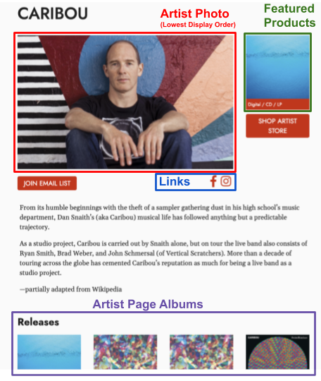

# How to Create Artist Pages:
> Edit artist photos, tour dates, roster status, social media links, featured products, email list and more!

## Getting Started
#### Located Under Artists:  
Or go straight here:  /cms/artists 
Select: **+ Add**  

Creating an Artist page is the first step for adding any new product or album. 

## Smart Import 
The Smart Import tool will quickly generate name, sort name, URL alias & Spotify Artist URI for existing artists. 

## Roster Status
Choose between Active Roster, Full Roster, Inactive or Not On Roster. 

Only artists that are Active Roster will display on the Artists drop down on the Menu bar. This list of artists is also located at at /artist. Full Roster artists are displayed at the bottom of the Artist section. 

**Example:** If you'd like to sell products from Artists that are not on your label you would assign them "Not On Roster" so they are not displayed on these lists. 

## Bio
Add information about the Artist here to be displayed on the Artist page. 

## Songkick Artist ID 
The Tour section pulls in tour dates based on the Songkick Artist ID entered in the Artist page. For additional help troubleshooting any problems with tour dates displaying &mdash; please see the [Tours](tours.md) section.

## Photo
The artist photo with the lowest display order will be shown on the artist page. Only one photo will be displayed at a time. 

## Email List

A “Join Email List” button will display if this artist has a Mailchimp URL and Has Email List is checked. 

## Links
A list of social media links will display underneath the artist photo. You can edit these pages in the Links tab of the Artist Detail page.

## Releases
Releases may be added to the artist page under the Artist Page Albums tab.  If there is a product associated with the album this image will be a link to that product.

