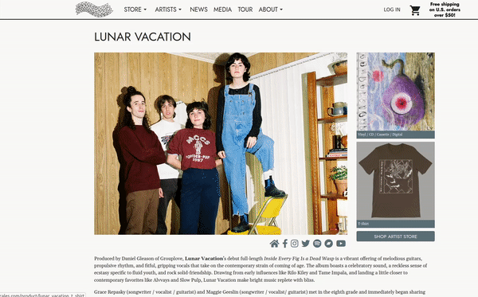
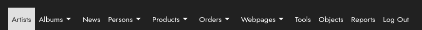
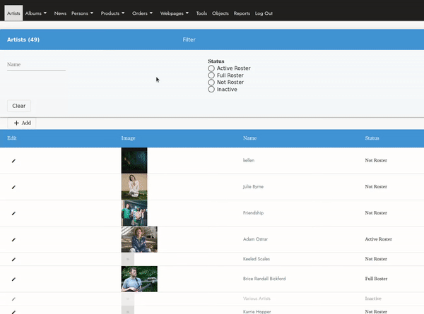
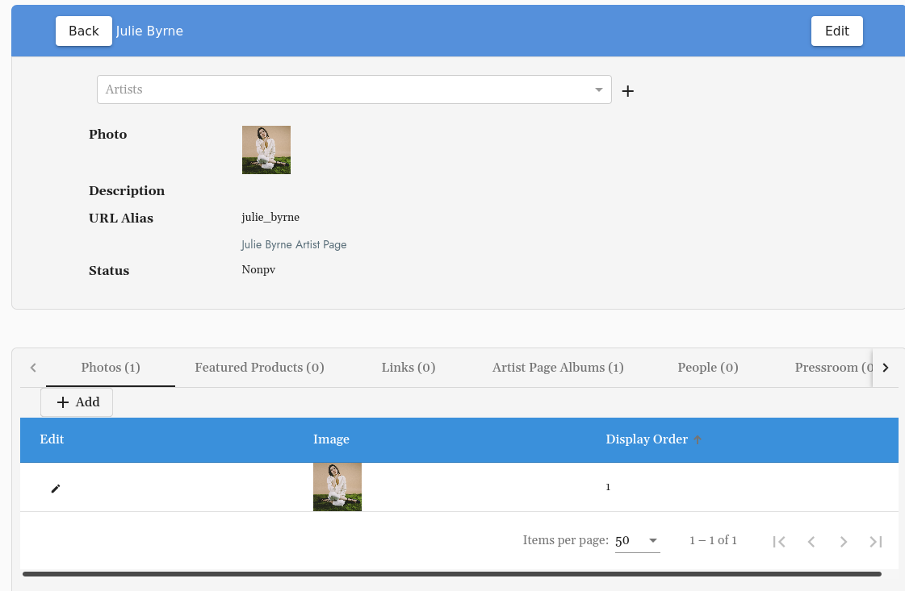
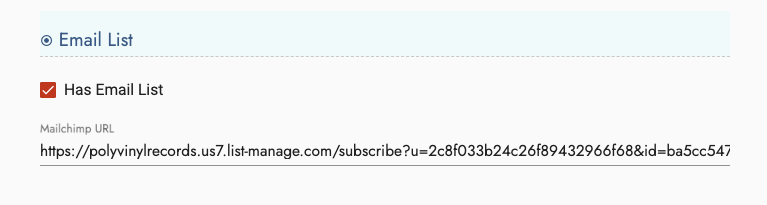
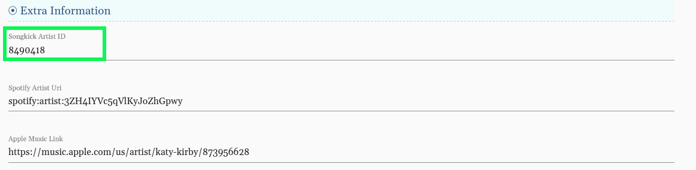
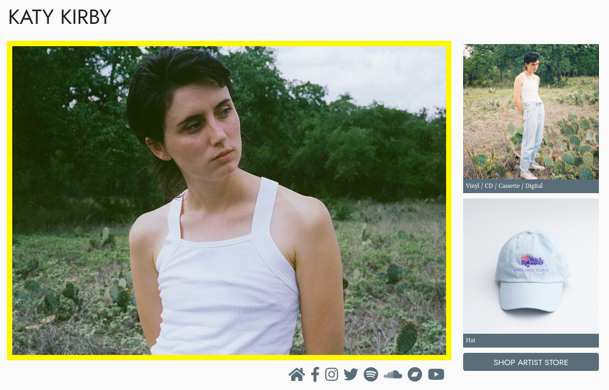
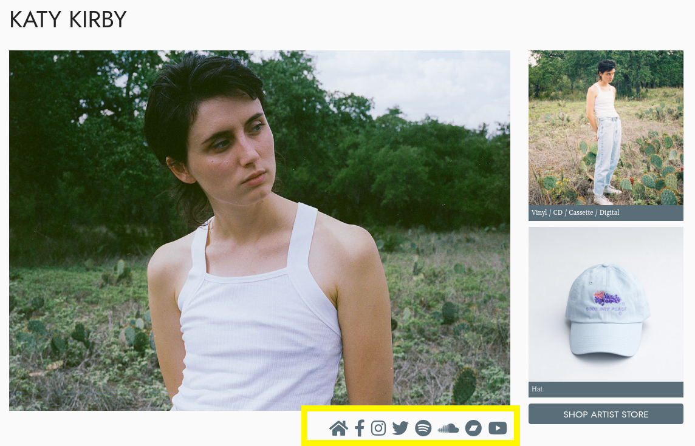
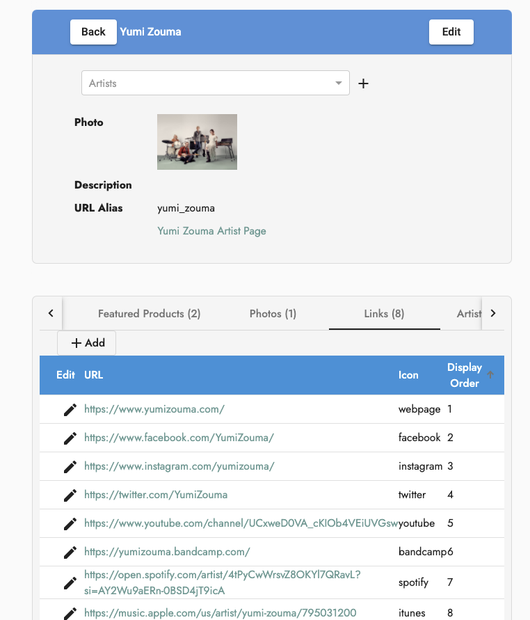
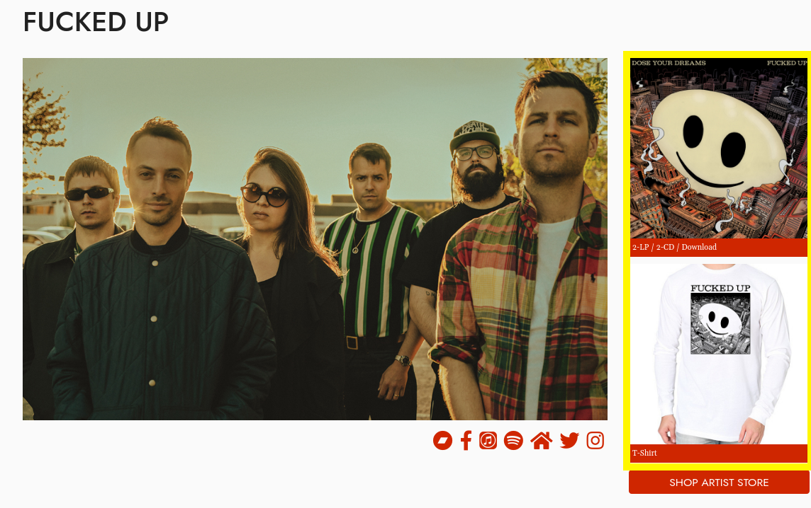

# How to Create Artist Pages:
> Edit Artist photos, tour dates, press contacts, roster status, social media links, featured products, email list and more!

## Table of Contents 
1. [Getting Started](#getting-started)
2. [Editing Artist Content & Info](#editing-artist-content-amp-info)
3. [Roster Status](#roster-status)
4. [Artist Bio](#artist-bio)
5. [Email List](#email-list)
6. [Tour Dates & Songkick Artist ID](#tour-dates-amp-songkick-artist-id)
7. [Artist Photo](#artist-photo)
8. [Social Media Links](#social-media-links)
9. [Artist Releases](#artist-releases)
10. [Featured Products](#featured-products)

## Getting Started
#### Located on the Toolbar Under "Artists":

Or go straight here:  ``/cms/artists`` 

**Select:``+ Add``**  
**This will bring you to a new Artist edit view.**
You can use the **Spotify Import** tool to quickly add the "Name", "Sort Name" and "URL Alias" &mdash; or add manually:

If entering this information manually, **don't forget to fill in the "URL alias".** To keep these consistent throughout your site, replace spaces with underscores so they match the Spotify Import generated URLs, for example: ``/artist_name``

## Editing Artist Content & Info

Once you've added a new Artist, there are two places to edit Artist content &mdash; the **edit view** and the **info view**:

The **edit view** is located by clicking the pencil icon or the "edit" button.

The **info view** is displayed after clicking on the Artist name link once you have created an Artist. In this example above we created an Artists, Julie Byrne, and then clicked the link which was located under the name column.

Here we can select the "edit button" for edit view, and also access info view to edit featured products, social media links, contacts and other data that is only accessible from this screen:

## Roster Status
Choose between **Active Roster**, **Full Roster**, **Inactive** or **Not On Roster**.

Only Artists that are "Active Roster" will display on the Artists drop down on the Menu bar. This list of artists is also located at ``/artist``.

"Full Roster" Artists are displayed at the bottom of "Active Roster" Artists in the Artist section.

**Example:** To sell products for Artists that are not on your label, you would still add them as an Artist in the CMS, but select "Not On Roster" so they are not displayed on the Artist page or drop down.

## Artist Bio
Add information about the Artist here to be displayed on the Artist page.

## Email List

A “Join Email List” button will display if this artist has a Mailchimp URL and "Has Email List" is checked.

## Tour Dates & Songkick Artist ID
The Tour section on each Artist page as well as the main Tour section of the website, pulls in tour dates based on the Songkick Artist ID.

In the Artist edit view, you can add "Songkick Artist ID"under **Extra Information**. You can find the artist Songkick Artist ID in the URL of their Songkick page

**Example:** ``https://www.songkick.com/artists/8490418-katy-kirby``.  
The Songkick Artist ID is: **8490418**

For additional help troubleshooting any problems with tour dates displaying &mdash; please see the [Tours](tours.md) section.

## Artist Photo
The Artist photo with the lowest display order will be shown on the Artist page. Only one photo can currently be displayed at a time.

## Social Media Links
Social media links will display underneath the Artist photo on the Artist page.

You can edit these pages in the Links tab of the Artist info page:

## Artist Releases
Releases may be added to the artist page under the "Artist Page Albums" tab. If there is a product associated with the album this image will be a link to that product.

## Featured Products
These products will be displayed to the right of the Artist photo. We recommend having two products here, they will auto populate with the Artist's best selling products.

