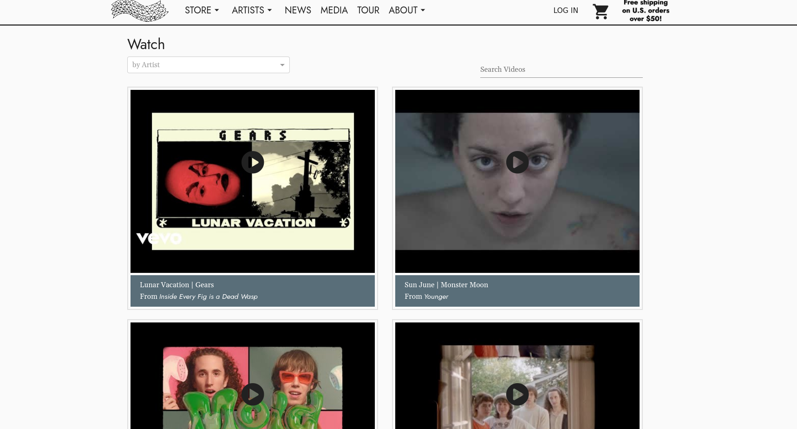

# How to Create New Artists & Artist Pages:
> Create a new Artist or edit Artist Page photos, tour dates, press contacts, roster status, social media links, featured products, email list and more!  
> **Quick Start: See [Getting Started](#getting-started) & [Editing: Edit View &amp; Info View](#editing-edit-view-amp-info-view)**

## Table of Contents 
1. [Getting Started](#getting-started) 
    - [Create Manually](#create-manually) 
    - [Import from Spotify](#import-from-spotify)
2. [Editing: Edit View &amp; Info View](#editing-edit-view-amp-info-view)
3. [Roster Status](#roster-status)
4. [Artist Bio](#artist-bio)
5. [Email List](#email-list)
6. [Tour Dates & Songkick Artist ID](#tour-dates-amp-songkick-artist-id)
7. [Artist Photo](#artist-photo)
8. [Social Media Links](#social-media-links)
9. [Artist Releases](#artist-releases)
10. [Featured Products](#featured-products)
11. [Music Videos](#music-videos)
## Getting Started
### Located on the Toolbar Under "Artists":

Or go straight here:  ``/cms/artists`` 

**Select:``+ Add``**  

### Adding an Artist

There's a level of flexibility when deciding how much detail to provide for any given artist. At a minimum, each artist should be created with a **Name**, **Sort Name** and **URL Alias**. 

- **Name:** Controls how the artist name will be displayed on the live site. 
- **Sort Name:** Controls how artist will be sorted alphabetically. The sort name for most bands will match their actual name. To sort individual names alphabetically by last name, the name should be listed with the last name (surname) first. **Example:** Rosenstock, Jeff vs American Football.  
- **URL Alias:** ``/artist_name`` lowercase, replace spaces with underscores: ``/jeff_rosenstock``
- **[Roster Status](#roster-status)**: Select either Active Roster, Full Roster, Inactive or Not On Roster. Click [here](#roster-status) for a more detailed description. 

You can add the above information **Manually** or using the **Spotify Import** tool: 

- #### **Create Manually**
Manually enter Artist Name, Sort Name, URL Alias and Roster Status (at a minimum) in order to save a new artist. 
    
- #### **Import from Spotify**
Enter the artists name into the "Smart Import" tool located at the top of the edit view, and select the artist to import:

## Editing: Edit View &amp; Info View

Once you've added a new artist, there are two places to edit artist content &amp; features &mdash; the **Edit View** and the **Info View**. 

### Edit View
Controls elements of both the artist and artist Page.  
The **edit view** is located by clicking the pencil icon or the "edit" button.

The following are located under the edit view: 
- Name
- Sort Name
- URL Alias
- [Status (Roster Status)](#roster-status)
- [Bio](#artist-bio)
- [Email List](#email-list)
- [Songkick Artist ID](#tour-dates-amp-songkick-artist-id)
- Spotify Artist URI
- Apple Music Link
- [ ] Hide Related Artists
- [ ] Show in Store Dropdown
- [ ] Show in News
- [ ] Pressroom

### Info View
Controls elements of Artist Page Features, such as featured products, social media links, contacts and other data that is only accessible from this screen. 

 

The following are located under the info view: 
- [Photo](#artist-photo)
- [Featured Products](#featured-products)
- [Links (social media links)](#social-media-links)
- [Artist Page Albums](#artist-releases)
- People (contacts such as publicists or booking agent)
- Pressroom 
- Albums 
- Tracks

## Roster Status
Any artist, band, label, company, or creator can be an "artist" and attached to a product. When creating an artist, choose between the following Roster Status options: **Active Roster**, **Full Roster**, **Inactive** or **Not On Roster**.

Only artists that are **Active Roster** will display on the artists drop down on the Menu bar. 

- **Active Roster**: Select for current label artists. Only artists that are "Active Roster" will display on the Artists drop down on the Menu bar. These artists are also displayed as an alphabetical list of thumbnails at ``/artist``.

- **Full Roster**: "Full Roster" artists are displayed alphabetically in a text based list alongside "Active Roster" artists below the "Active Roster" section at ``/artist``.

- **Inactive**: Hidden. 
- **Not on Roster**: Will not display at `/artist` or in the artist dropdown on the Menu bar. Use when selling products for artists that are not on your label, label specific merch, or other companies/partners.

## Artist Bio
This section is often used for more general, non release-specific information about the artist. Typically this would be different than an Album bio that might be included as a product description, for example.

This will be displayed on the artist page under the artist photo: 

## Email List

A “Join Email List” button will display if this artist has a Mailchimp URL and "Has Email List" is checked.

## Tour Dates & Songkick Artist ID
The Tour section on each Artist Page, as well as the main Tour section of the website, pulls in tour dates based on the Songkick Artist ID. This input field can be found on the artist edit view.

Once on the artist edit page, the "Songkick Artist ID" will be located under **Extra Information** section. If you don't know the Songkick Artist ID already, you can look it up in the URL of their Songkick page:

**Example:** <code>https://www.songkick.com/artists/<b><u>8490418</b>-katy-kirby</u></code>  
The Songkick Artist ID is: **8490418**

For additional help troubleshooting any problems with tour dates displaying &mdash; please see the [Tours](tours.md) section.

## Artist Photo
The artist photo with the lowest display order will be shown on the artist page. Only one photo can currently be displayed at a time.

## Social Media Links
Social media links will display underneath the artist photo on the artist page.

You can edit these in the Links tab of the artist info page:

## Artist Releases
Releases may be added to the Artist Page under the "Artist Page Albums" tab in the info view. 

These albums will display under the Artist Releases section of the Artist Page. 

Click ``+Add `` to add a new album. The album must exist in the CMS. For help creating a new album check out the [Creating an Album](album.md) page.

## Featured Products
These products can be edited from the info view and will be displayed to the right of the artist photo. We recommend having two products here. These can be manually updated or will auto populate with the artist's best selling products.

## Music Videos
See [Adding YouTube Videos](Youtube.md) for how to add YouTube videos to display in the Media and Artist Page sections.

