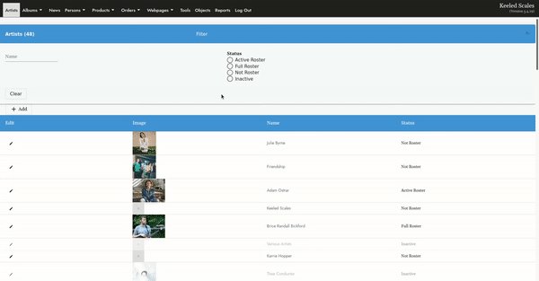
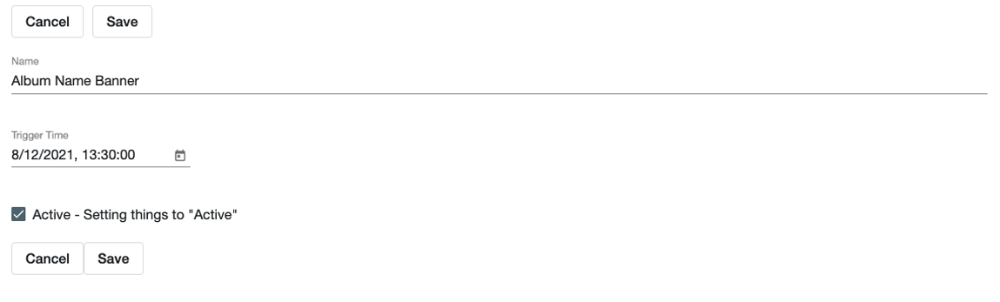
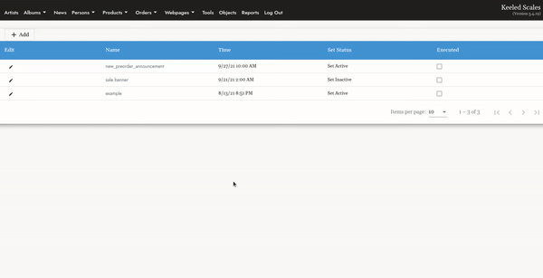

# How to Use the Automation Tool:
> Quickly schedule news, tracks, albums, banners, products, bundles and product lists to be ACTIVE or INACTIVE at a set time! 

Before you start &mdash; double check the items you'd like to set active or inactive are updated correctly in the CMS. 

For example: If you want to turn an inactive item active at a certain time, make sure that item is set inactive.  

## Table of Contents
1. [Getting Started](#getting-started)
2. [Name](#name)
3. [Trigger Time](#trigger-time)
4. [Active - Setting Items to "Active"](#active-setting-items-to-quotactivequot)
5. [Inactive - Setting Items to "Inactive"](#inactive-setting-items-to-quotinactivequot)
6. [Adding Items](#adding-items)

## Getting Started
#### Located Under "Tools" on the Menu Bar:  
Select "Automators"  
Or go straight here:  ``/cms/automators`` 
 
Select: **+ Add**  

## Creating a New Automation  

<kbd></kbd>
 

### Name
Internal. Whatever you want! 

**Example:** If this is for an album pre-order with multiple items, you may want to name it by the album release. 

You will be able to place a variety of different items under this one automation to turn off or on at the same time &mdash; such as banner images, news items, products.

### Trigger Time

**Use 5 minute increments when setting time, otherwise will just round up to nearest 5 minute increment.**  
 

**Example:** To set Trigger Time for ``10:30``, you can enter a time of anywhere from `` 10:30:00`` to ``10:25:01``. Make sure the seconds are set to ``:00``, as ``10:30:01`` would result in rounding up to ``10:35:00``. 

### Active - Setting Items to "Active" 

__Example:__ 
- Pre-order announcement. 

### Inactive - Setting Items to "Inactive"  

__Example:__ 
- Making banner, products or product list inactive when a sale ends.
- Making products inactive in future when distribution rights change.

## Adding Items

Once you've created a new Automator, click on the Automator to edit. 
Here you will see a recap of what this Automator will do: 

Next, click the **+ Add** button to add what items you'd like to schedule. 

Select from the following types from the drop down: 
- Product
- Product Instance
- Bundle 
- Album 
- Banner
- Product List 
- Track 
- News 

Then select the item you'd like to schedule & hit save!  
