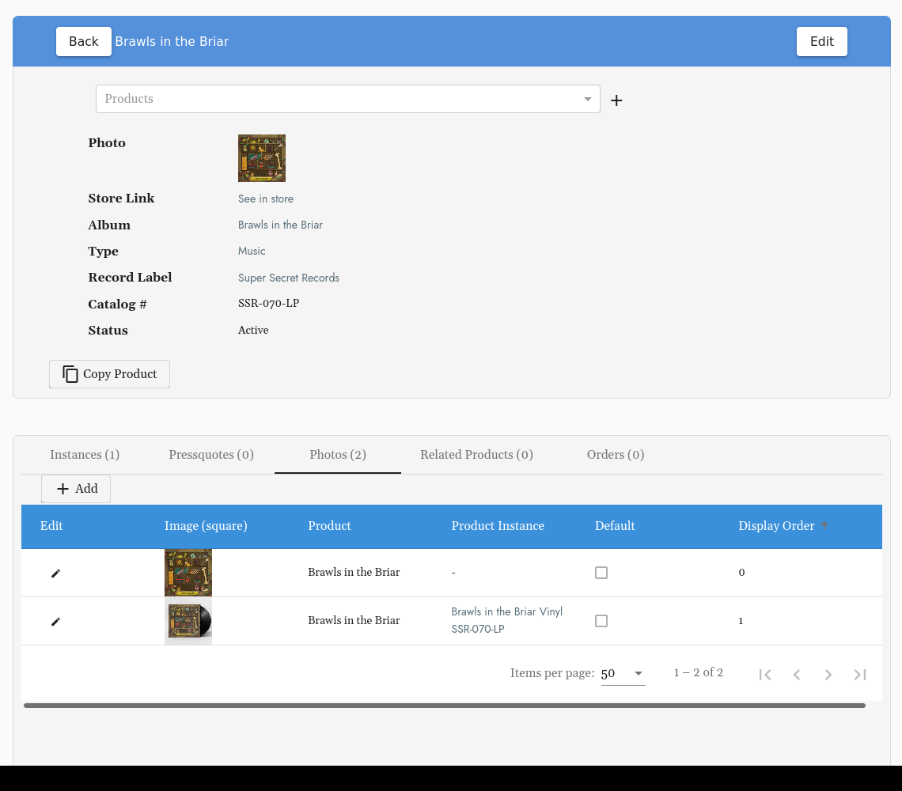

# How to Create a New Product Instance:
> Instances are different formats of the same Product.

## Table of Contents

1. [Getting Started](#getting-started)
2. [Instance Type](#instance-type)
3. [Inventory & Low Inventory Amount](#inventory-amp-low-inventory-amount)
4. [Weight](#weight)
5. [Bookkeeping ID & Catalog Number](#bookkeeping-id-amp-catalog-number)
6. [UPC Code & Report to Soundscan](#upc-code-amp-report-to-soundscan)
7. [Instance Specific Product Photos](#instance-specific-product-photos)

## Getting Started
#### Located Under Products:  
Or go straight here:  ``/cms/productinstances``  
Select: **+ Add**  

**Prior to creating a Product Instance &mdash; the Product, Album and Artist must be created.**

## Instance Type
Select the lowest level type here. 

**Example**: Digital, LP, CD. 

## Product Options
This is where you would specify instance details such as a size for a T-Shirt or a color variant or vinyl weight for an LP.

## Inventory & Low Inventory Amount
Set a low inventory threshold so you'll receive an email whenever inventory hits this amount. 

## Weight 
Default weights are entered in at the Product Type Level. This will pre-populate based on the type you select, or you can enter manually. 

## Bookkeeping ID & Catalog Number
Bookkeeping IDs and Catalog #s may be the same. If you use a different ID for accounting other than the product Catalog #, enter that here. If you use the catalog # for bookkeeping, these will be the same. 

## UPC Code & Report to Soundscan 
In order to be included on your Soundscan report be sure to include the UPC here as well as click the Report Soundscan button. 

## Instance Specific Product Photos
Product shots or mock ups for each instance can be added at the Product Level info view: 

