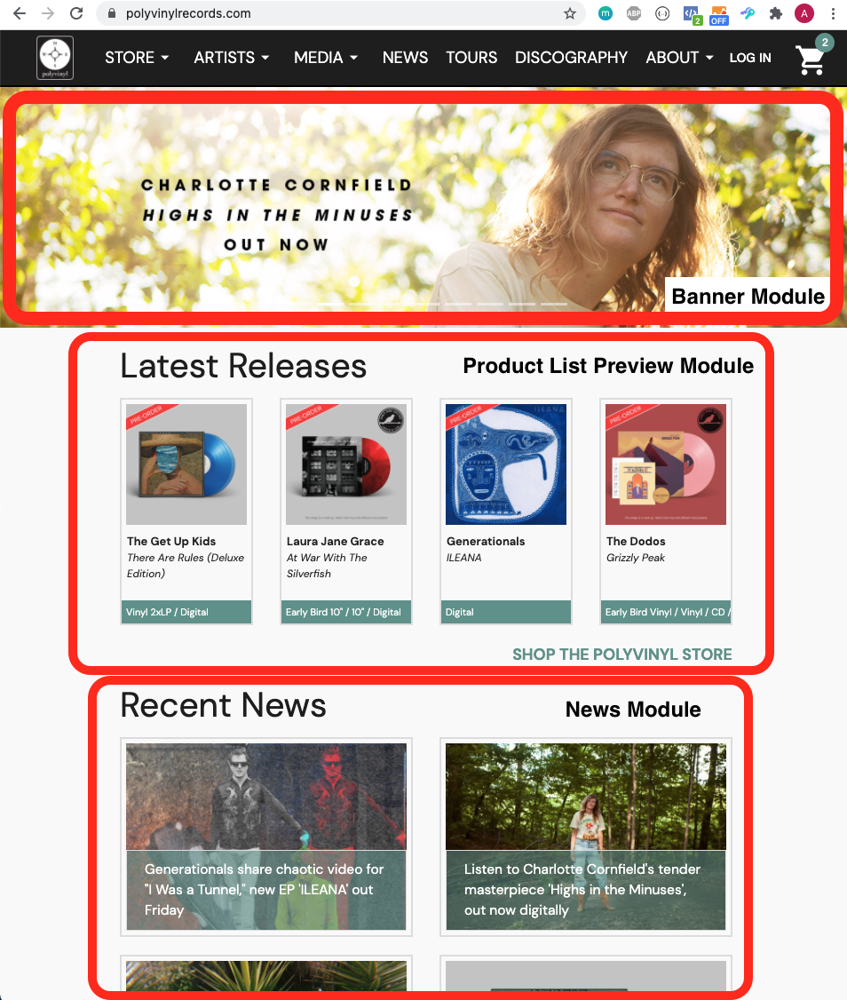
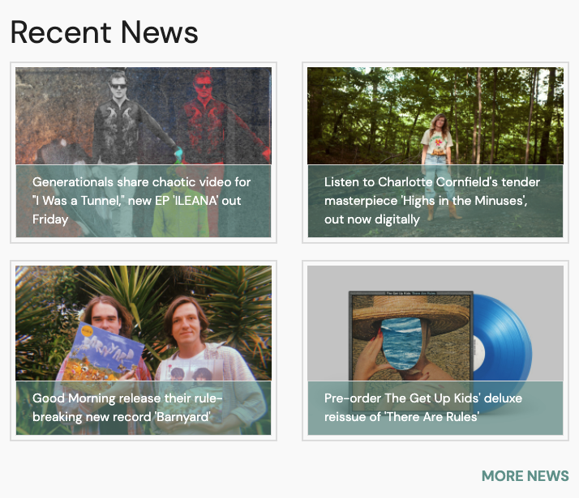
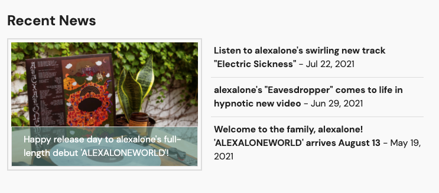

# What are Page Layouts?
> Page Layouts describe the layout of the Home, Product, Artist, and Pressroom pages.

## Getting Started
### What are Modules?
Modules are the building blocks of each page.  The default home page consists of:
1. Banner Module
2. Product List Preview Module
3. News Module
4. Videos Module

### What Modules can I use?
#### Banner Module
Displays a carousel of active banners from /cms/banners

#### Product List Preview Module
Displays the first **Group** of a specific **Product List**.

#### News Module
Displays relevent news items depending on the page type.  Home page shows the latest news items.  Pressroom and Artist pages show the latest news items from the artist.

**(Larger Previews on Home Page)**

**(Concise Previews on Artist Pages)**

#### Videos Module
Displays relevant videos depending on the page type.  Home page shows the latest videos.  Pressroom and Artist pages show the latest videos from the artist.  Product pages show any videos related to the product's album.

#### Description Module
Displays text from HTML format.  Useful for artist bios and product descriptions