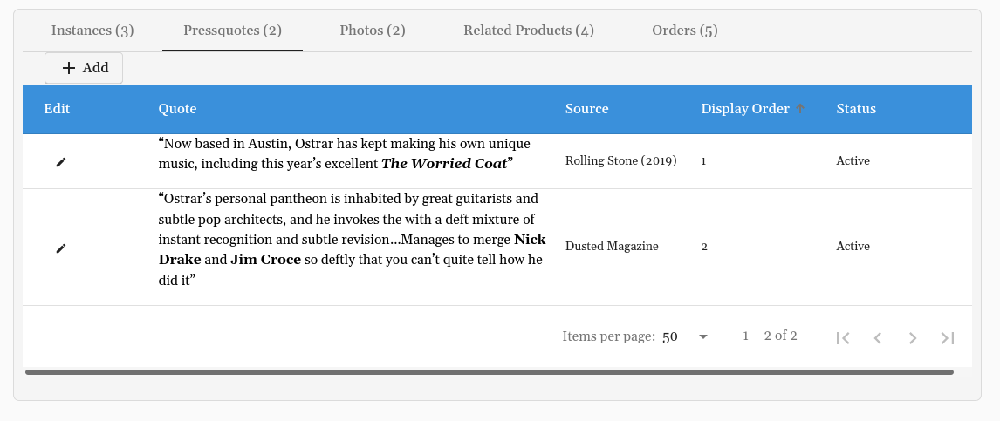
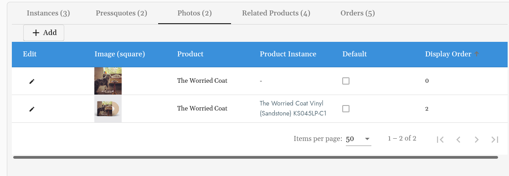

# How to Create a New Product:
> Add product description, overlays, Spotify URI and record label on the Product level. 

## Getting Started
#### Located Under Products:  
Or go straight here:  /cms/products  
Select: **+ Add**  

**Prior to creating a Product, the [Album](album.md) and [Artist](artist_page.md) must be created.** 

If any of the above have not been created, you can select the **+** when you need to add an Artist or Album you have not yet added. 

## Type 
Select from the (PARENT) options in the drop down.

**Example:** LP, CD, digital releases will have product types Music (PARENT)

## Pressquotes

Add press quotes on the details/ info view of each product to be displayed on the Product page: 

## Photos

You must have a photo in order for the product to be live. The image used for the Album will automatically generate, but here you can also add additional images that link to specific instances. Edit the display order of each image. 

The photo with the lowest display order will be displayed first: 

## You Might Also Like Section

Add related products to be displayed on the Product page: 

These are located under **Related Products** on the info/ details view of each Product: 

