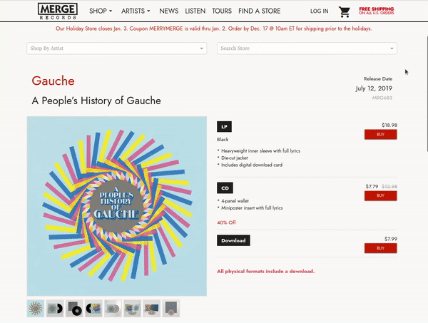
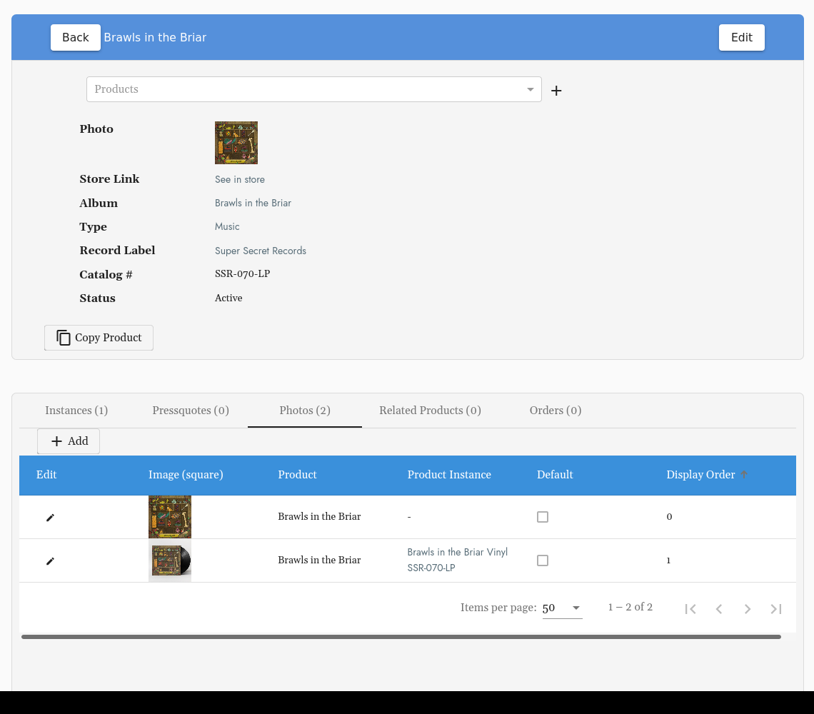
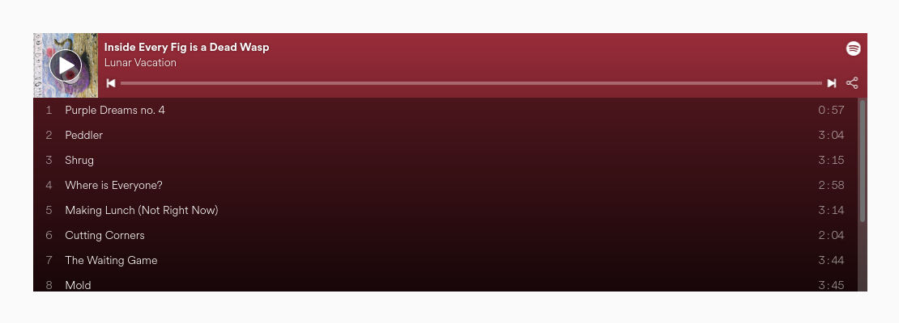

# How to Create a New Product:
> Add Product Description, Sale or Pre-Order Overlays, Spotify URI, Record Label and more for a Product.

## Table of Contents

1. [Getting Started](#getting-started)
2. [Product Type](#product-type)
3. [Pressquotes](#pressquotes)
4. [Product Photo](#product-photo)
5. [Spotify URI](#spotify-uri)
6. [You Might Also Like Section](#you-might-also-like-section)

## Getting Started
#### Located Under Products:  
Or go straight here:  ``/cms/products``  
Select: **+ Add**  

**Prior to creating a Product, the [Album](album.md) and [Artist](artist_page.md) must be created.** 

If any of the above have not been created, you can select the **+** when you need to add an Artist or Album you have not yet added. 

## Product Type 
Select from the (PARENT) options in the drop down.

**Example:** LP, CD, digital releases will have product types Music (PARENT)

## Pressquotes

Add press quotes on info view of each product to be displayed on the Product Page: 

## Product Photo

You must have a photo in order for the product to be live. 

For a music product you can add the album artwork here, you will have an opportunity to add format specific mock ups of or photos once you've created instances.

The photo with the lowest display order will be displayed first: 

Once you [create instances](instances.md) you can add instance specific product photos here as well 

## Spotify URI
To add Spotify player for album onto product page. 

This will be added automatically if you use the Spotify Import tool, but you can also enter it in yourself by looking it up in Spotify:

## You Might Also Like Section

Add related products to be displayed on the Product page: 

These are located under **Related Products** on the info/ details view of each Product: 

