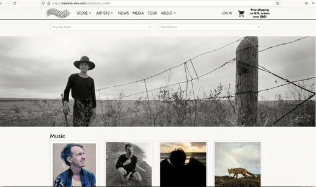

# How to Create Product Lists
> Create lists of products to display throughout the site or to group certain products together. 
> Use Product Lists to build Artist Stores, Sales, Webstore Sections and more! 

## Getting Started 
### Located Under Products on the Menu Bar:  
Select "Product Lists" at bottom of drop down menu  
Or go straight here:  ``/cms/prod-list`` 
Select **+ Add**  

Click on the new Product List to edit. 
Select **+ Add** to add Products to the list. 

You can add individual Product Instances &mdash; but you will likely save time by utilizing the Product List filters to create groups within your Product List. 

### Product List Filters
Product List Filters determine exactly which products are shown. You may select and combine the following filters:

- Artist
    - Select products and bundles only from these artists
- Product Instance
    - Select specific product instances
- Product/Bundle
    - Select specific products and bundles
    -  Allows for custom sorting
- Record Label
    - Select specific record labels
- Release Type
    - Select only releases of a certain type (Album/EP/Single/etc)
- Product Type
    - Select only products of a certain type (Vinyl/Clothing/etc)
- Exclude Product Instances
    - Exclude specific product instances
- Exclude Product
    - Exclude All Products or only specific products
- Exclude Bundle
    - Exclude All Bundles or only specific bundles
- Exclude Record Label
    - Exclude products from a given Record Label
- Exclude Type
    - Exclude Products from a given type

Custom sorting is available for custom product/bundle groups. Simply select the products and bundles you would like to display, then drag and drop them to the desired order.

### Photo Type
Adding a Photo Type to a Group will display a photo of that type if it exists. It is common to display the Vinyl Photo Type for vinyl sales, and the Cassette Photo Type for cassette sales. If there is no image of that type the Default image will be displayed.

### Sort
Add a sort to arrange products and bundles by Title, Release (oldest to newest, Release Desc (newest to oldest) Artist, Format, or a Custom Sort.

## Artist Stores

You can use Product Lists to create Artist Stores! By default, for each Artist an Artist Store Page will be generated at ``store/artist_name_url``. 

**Example:** ``https://keeledscales.com/store/knife_in_the_water``

By creating a new Product List at this same URL Alias, we will override the automatically generated one. So, make sure you're spelling the artist name correctly in the URL Alias. This Product List edit page is also where you would add a banner image for your Artist Store. 

See below for an example of an Artist Store, complete with banner and product list groups with labels:

 

## Sales
Create a Product List for each group of sale items. Pick a few price tiers (3-4). 

**Example:** $15, $20, $25. 

## Webstore Sections

You can create Product Lists to link to from the website Toolbar drop down. See the [Toolbar](Toolbar.md) section for how to edit your sites navigation. 

**Example:** Pre-Orders & New Releases, Featured Products

