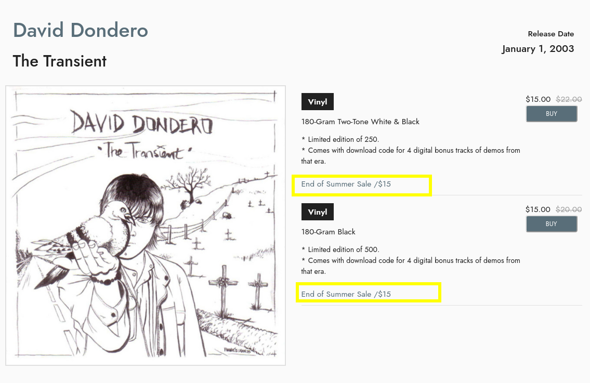
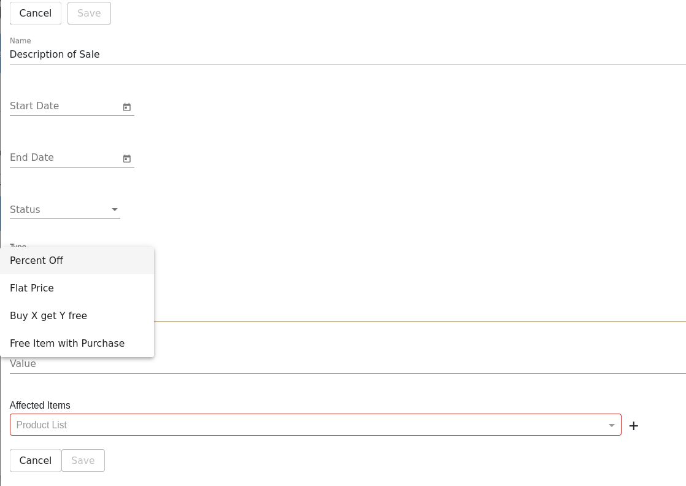
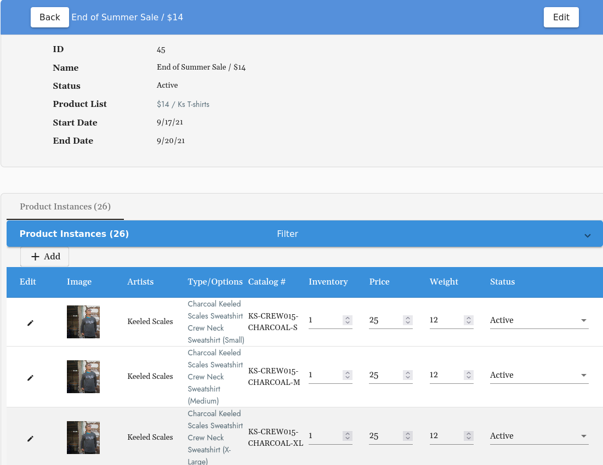

# How to Schedule a Sale
> Bulk update sale prices and determine length of sale. 

## Table of Contents
1. [Getting Started](#getting-started)
2. [Affected Items](#affected-items)
3. [Sale Info View](#sale-info-view)

## Getting Started
### [Product Lists:](product_lists.md)
The first step is to create a [**Product List**](product_lists.md) to group the products you wish to put on sale together. We would recommend picking a few price tiers to group products into.

**Example** $15, $20, $25 or 10%, 15%, 30% off. 

### Located Under Products on the Menu Bar:  
Select **Sale** in the Products drop down 
Or go straight here:  ``/cms/sale`` 
Select **+ Add**  

Add Sale Name. **The name you choose will be visible to customers on the product page:**

Next, select a Start Date & End Date

Adjust Status to "Active" or "Inactive". If you've selected a future Start Date or want the sale to start right away, you can select Active and it will turn on at the selected Start Date time.  

Select "Type" from the drop down options: 

- Percent Off
- Flat Price 
- Buy X get Y Free 
- Free Item with Purchase

Based on the type you can put in the next Value

**Example:** If you select Flat Price you would add in $10.

## Affected Items: 
Select the Product List you would like to apply the sale pricing to here &mdash; or select the **+** to create a new Product List. 

## Sale Info View
``cms/sale/info/``

Here you can adjust inventory and see a list of all the Products Instances included in your Sale. 

This is a quick way to view the inventory of the sale items and edit as needed. 

**Please note, if a product instance has 0 inventory it will NOT show up on this view** 

If you notice an item is not showing on this view that should be search for it in Product Instances and make sure the stock is more than 0 and the product is marked Active. 