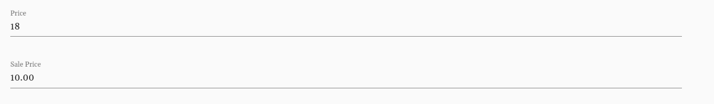
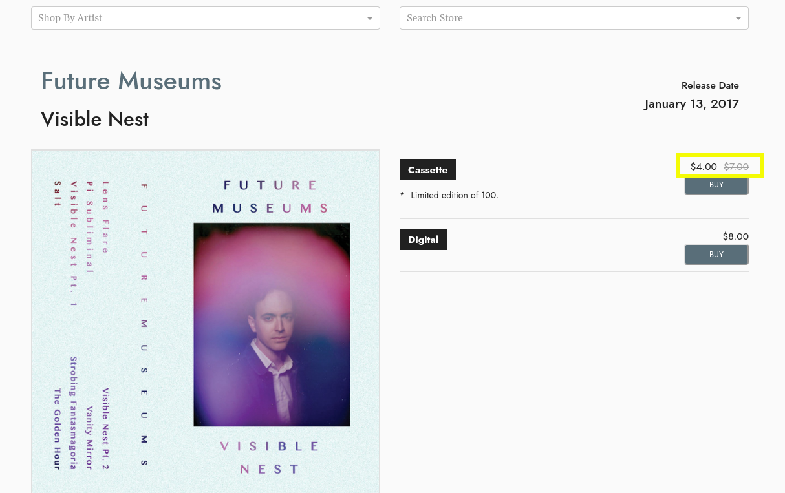

# How to Add Sale Pricing to One Item 
> You can schedule multiple items on sale by following the instructions **[here](sale.md)** &mdash; but if you just want to edit sale pricing for one item, you can edit this on the individual product instance page. 

## Getting Started 
#### From the Menu Select Product Instances Under the Product Drop Down

You can navigate to a particular Product Instance a variety of ways. For reference, Product Instances (formats such as CD or LP) are nested under Products. Album > Product > Product Instance.

Search for the Product Instance you want to add sale pricing to, click the link to edit. 

Under the Price, add Sale Price

The Sale Price will display on the product page with the regular price crossed out and the new sale price displayed next to the product instance: 

#### Overlay 

On the Product edit screen you can add an Overlay that will display on the product whenever it is listed throughout the site. 

**Don't forget to remove the Sale Pricing & Overlay manually if you only want the sale pricing to be for a limited time.** Sale pricing for individual product instances cannot currently be scheduled. 