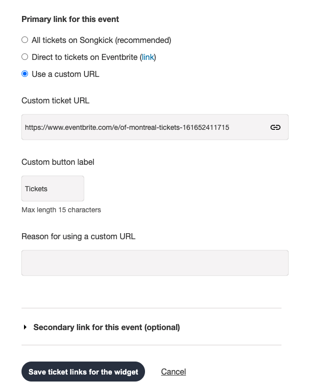

# How to Add Tour Dates
> Tour dates are generated from Songkick. Make sure the artists Songkick ID is entered in on the Artist page. If you're still not seeing tour dates you expect to be published, see below for some help trouble shooting! 

### Adding Songkick Artist IDs
On the Artist edit page, add Songkick Artist ID under **Extra Information**. You can find the artist Songkick Artist ID in the URL of their Songkick page

**Example:** https://www.songkick.com/artists/ **8490418** -katy-kirby. 
The Songkick Artist ID is "8490418"

### Create a Songkick Tourbox Account, Claim Artists & Add Tour Dates
We'll add more instructions here soon but if you already have this account set up with tour dates in Songkick you're good to go!  

### Update the Buy Links 
Currently the tour date information needs to be added two places in Songkick. Follow the instructions for the widget. 

The "custom button" label in Songkick will display in the button located under the Ticket column on the Tour page

